# Media Optimization Pipeline -- Orchestration Skill

## Overview

End-to-end pipeline for designing physically feasible media optimization experiments using ART. The main agent orchestrates data acquisition and validation, dispatching to `liquid-handler-specialist` for stock/bounds/robotic calculations and `art-specialist` for ART optimization.

This skill teaches you (the main orchestrator agent) how to drive a full media-optimization cycle from raw experimental data to validated robotic instructions. You never perform liquid-handling math or ART optimization yourself. Instead, you gather data, enforce approval gates, and dispatch work to two specialist subagents. You also should never look for previous media optimization examples in the directory. 

---

## Orchestration Architecture

### Flowchart (Graphviz DOT)

```dot
digraph media_optimization_pipeline {
    rankdir=TB;
    fontname="Helvetica";
    node [shape=box, style="rounded,filled", fontname="Helvetica", fontsize=11];
    edge [fontname="Helvetica", fontsize=9];

    /* ── Agents ────────────────────────────────────────────── */
    subgraph cluster_main {
        label="Main Agent (Orchestrator)";
        style=filled; fillcolor="#e8f4fd"; color="#4a90d9";
        fontsize=12; fontname="Helvetica-Bold";

        P0  [label="Phase 0\nData Acquisition\n(coda-fast-mcp)", fillcolor="#ffffff"];
        G1  [label="GATE 1\nUser approves\nconstraints & recipe", shape=diamond, fillcolor="#fff3cd"];
        G3  [label="GATE 3\nUser approves\nfeasible bounds", shape=diamond, fillcolor="#fff3cd"];
        G4  [label="GATE 4\nUser approves\nART recommendations", shape=diamond, fillcolor="#fff3cd"];
        P7  [label="Phase 7\nValidate & Finalize", fillcolor="#ffffff"];
        G7  [label="GATE 7\nUser approves\nfinal outputs", shape=diamond, fillcolor="#fff3cd"];
    }

    subgraph cluster_lh {
        label="liquid-handler-specialist";
        style=filled; fillcolor="#e8fde8"; color="#5cb85c";
        fontsize=12; fontname="Helvetica-Bold";

        P1  [label="Phase 1\nGather Constraints", fillcolor="#ffffff"];
        P2  [label="Phase 2\nStocks & Bounds", fillcolor="#ffffff"];
        P3  [label="Phase 3\nLHS Verification", fillcolor="#ffffff"];
        P5  [label="Phase 5\nTarget Concentrations", fillcolor="#ffffff"];
        P6  [label="Phase 6\nRobotic Instructions", fillcolor="#ffffff"];
    }

    subgraph cluster_art {
        label="art-specialist";
        style=filled; fillcolor="#f0e8fd"; color="#8a6dba";
        fontsize=12; fontname="Helvetica-Bold";

        P4  [label="Phase 4\nART Optimization", fillcolor="#ffffff"];
    }

    /* ── Data flow edges ──────────────────────────────────── */
    P0 -> P1 [label="standard_recipe.csv\ntraining_data.csv\nexperiment constraints"];
    P1 -> G1 [label="constraints summary"];
    G1 -> P2 [label="approved constraints"];
    P2 -> P3 [label="stock_concentrations.csv\nfeasible_bounds.csv"];
    P3 -> G3 [label="feasible_bounds.csv\nstock_concentrations.csv\nLHS success rate"];
    G3 -> P4 [label="feasible_bounds.csv\ntraining_data.csv\nart_config.csv"];
    P4 -> G4 [label="recommendations_current_cycle.csv"];
    G4 -> P5 [label="recommendations_current_cycle.csv\nstock_concentrations.csv\nstandard_recipe.csv"];
    P5 -> P6 [label="target_concentrations.csv\nstock_concentrations.csv"];
    P6 -> P7 [label="robotic_instructions.csv\ntarget_concentrations.csv"];
    P7 -> G7 [label="validation report\nfinal file manifest"];
}
```



### How to Read This Diagram

- **Boxes** are execution phases. Green cluster = liquid-handler-specialist, purple cluster = art-specialist, blue cluster = main agent.
- **Diamonds** are approval gates where you must pause and present results to the user before continuing.
- **Edge labels** show the CSV files and data that flow between phases at each handoff.

---

## Phase Table with Agent Ownership

| Phase | Owner | Templates / Scripts | Approval Gate? |
|---|---|---|---|
| **0: Data Acquisition** | Main agent (via `coda-fast-mcp`) | -- | No |
| **1: Gather Constraints** | `liquid-handler-specialist` | `experiment_config_template.csv`, `standard_recipe_template.csv`, `bounds_template.csv` | **Yes** (3 files) |
| **2: Stocks & Bounds** | `liquid-handler-specialist` | `stocks_bounds_lib.py`, `calculate_stocks_and_bounds.py` | No |
| **3: LHS Verification** | `liquid-handler-specialist` | `verify_lhs.py` | **Yes** |
| **4: ART Optimization** | `art-specialist` | `art_config_template.csv`, `run_art_optimization.py` | **Yes** |
| **5: Target Concentrations** | `liquid-handler-specialist` | `generate_target_concentrations.py` | No |
| **6: Robotic Instructions** | `liquid-handler-specialist` | `generate_media_instructions.py` | No |
| **7: Validate & Finalize** | Main agent | `validate_lh_instructions.py`, `finalize_hitpick.py` | **Yes** |

### Phase Details

#### Phase 0: User Context & Data Acquisition (Main Agent)

**CRITICAL: Establish user and project context first.**

Before starting any work, you MUST capture user context to ensure proper isolation:

1. **User Email**: Ask for the user's email (e.g., scientist@lab.edu)
   - Used to organize projects by user
   - Enables multi-user workflows
   - Example: `alice@example.com`

2. **Project Slug**: Ask for a short, alphanumeric identifier for this experiment (e.g., `flaviolin_opt_cycle1`)
   - Lowercase, alphanumeric, hyphens only
   - Used to organize files: `/shared/user_impl_alpha/{email}/{slug}/`
   - Example: `media_opt_v2`

**All subsequent work must use**: `/shared/user_impl_alpha/{user_email}/{project_slug}/` as the project root directory.

This is a critical requirement to avoid cross-project contamination and ensure user isolation.

---

Once user/project context is established, use `coda-fast-mcp` or direct file reads to gather:

1. **Standard recipe CSV** -- must contain columns: `Component`, `Concentration`, `Solubility`.
2. **Training data CSV** -- historical experimental results with component concentrations and response variable(s). May be absent for initial cycles.
3. **Experiment constraints** -- hardware parameters (well volume, min transfer volume, dead volume, tip capacity, source well max volume, destination well max volume). For culture volume: ask for either `CULTURE_FACTOR` (e.g. 100 for 1% inoculum) or `V_INOCULUM` (e.g. 15 uL) — one is sufficient, the other is derived as `V_INOCULUM = V_TOTAL / CULTURE_FACTOR`.

If any of these are missing, ask the user directly. Do not guess hardware parameters.

##### Fast-Path Check

If the user has historical data or prior cycle results, ask these questions:

1. "Do you want to use the same bounds as the previous data you have provided?"
2. If yes: "Do you have the bounds file (`feasible_bounds.csv`)?" and "Do you have the stock concentrations file (`stock_concentrations.csv`)?"
3. "Do you want to generate robotic instructions, or just get ART recommendations?"

**Fast-path entry points:**

| Scenario | Entry point | What gets skipped |
|---|---|---|
| No prior data, no training data, needs initial designs | Phase 1 (bounds) then Phase 4 with `initial_cycle=True` | Phases 5-7 (unless user also wants LH instructions) |
| No prior data, needs full pipeline | Phase 1 | Nothing |
| Has bounds + stocks + config, needs LH instructions | Phase 3 (LHS validation) | Phases 1-2 |
| Has bounds + stocks + config, only needs ART recs | Phase 4 | Phases 1-3, 5-7 |
| Has bounds only (no stocks), needs LH instructions | Phase 2 (compute stocks) | Phase 1 |
| Has training data + bounds, needs ART recs | Phase 4 | Phases 1-3, 5-7 |
| Has training data, no bounds, needs ART recs | Phase 4 (bounds inferred from data) | Phases 1-3, 5-7 |

**Key rules:**
- **LHS validation is ALWAYS required** before generating robotic instructions, even if the user says "I have done this before."
- The user CAN skip Phases 1-3 and 5-7 and go directly to Phase 4 if they only need ART recommendations.
- If the user has no historical data and only bounds, use `initial_cycle=True` in ART (see below).
- If the user skips to ART but later wants robotic instructions, they must go back through Phases 1-3 first (or provide verified bounds/stocks).

##### Initial Cycle (No Historical Data)

When the user has no training data (first DBTL cycle), ART runs in initial cycle mode using Latin Hypercube Sampling to generate an initial experimental design that evenly explores the parameter space.

**ART parameters for initial cycle** (set in `art_config.csv`):
- `initial_cycle=TRUE`
- `components_for_optimization` (component names)
- `num_recommendations` (total designs, e.g. 14)
- `bounds_file` (path to feasible bounds — required for initial cycle since there's no data to infer from)
- `seed` for reproducibility

Not needed for initial cycle: `target_for_optimization`, `niter`, `burn_in`, `cross_val`, `tpot_models`.

**Important**: Do NOT confuse the log/linear scaling (described below) with ART's `input_var_type` parameter. `input_var_type` in ART means numerical vs categorical. The log/linear scaling is a **bounds transformation** done by the orchestrator before/after ART.

##### Linear vs Log Sampling (Scale Column in Bounds Template)

The user MUST choose whether each component is sampled in **linear** or **log** space. This is set in the `Scale` column of the bounds template. Ask the user explicitly.

**How it works (bounds transform before ART, inverse-transform after):**
1. For log-scale components, bounds are log10-transformed before passing to ART.
2. ART's internal LHS samples evenly in the transformed space.
3. After ART returns recommendations, log-scale components are inverse-transformed: `concentration = 10^(value)`.

Functions `transform_bounds_for_art()` and `inverse_transform_recommendations()` in `stocks_bounds_lib.py` handle this.

**Linear** (`Scale=linear`):
Samples are evenly spaced between Min and Max. Use when the response scales proportionally with concentration, or when the range is narrow (Max/Min < 10).

Example — bounds [2, 200], 5 LHS samples:
```
Samples: ~[20, 60, 100, 140, 180]
```

**Log** (`Scale=log`):
Samples are evenly spaced on a log10 scale. More coverage at the lower end. Use when effects are proportional to fold-changes, or when the range spans orders of magnitude (Max/Min > 10).

Example — bounds [2, 200], 5 LHS samples:
```
Before ART:  bounds → [log10(2), log10(200)] = [0.301, 2.301]
ART samples: ~[0.5, 0.9, 1.3, 1.7, 2.1]
After inverse: ~[3.2, 7.9, 20, 50, 126]
```
Much better coverage of the 2-20 range compared to linear.

**Rule of thumb:** If Max/Min > 10, consider log. If Max/Min <= 10, linear is usually fine.

#### Phase 1: Gather Constraints (liquid-handler-specialist)

Dispatch to the liquid-handler-specialist to prepare **three input files** from the templates. The user must **confirm each file individually** before proceeding:

1. **`standard_recipe.csv`** (from `standard_recipe_template.csv`) — Lists every component the robot pipettes individually. For each component the user sets: standard concentration, solubility, and `Variable` (Y/N). `Variable=Y` means ART optimizes its concentration; `Variable=N` means it is always dispensed at standard concentration (e.g., an antibiotic). Components inside a pre-made master mix are **not listed here** — their volume is captured by `BASE_MEDIA_VOL` instead.
2. **`experiment_config.csv`** (from `experiment_config_template.csv`) — Hardware parameters (V_TOTAL, V_INOCULUM, BASE_MEDIA_VOL, MIN_TRANSFER, CULTURE_FACTOR) and default calculation parameters. `BASE_MEDIA_VOL` is the volume of any pre-made master mix added to every well; set to 0 if all components are pipetted individually. User fills in all REQUIRED fields and confirms.
3. **`bounds.csv`** (from `bounds_template.csv`) — Per-component bounds for `Variable=Y` components only. User can set Min/Max as multipliers OR absolute concentrations, or leave blank for programmatic defaults. Concentration takes precedence over multiplier if both are set.

The specialist should also:
- Look up any missing solubility data.
- Identify fresh components.

**Gate 1**: Present each filled file to the user for individual confirmation. All three files must be explicitly approved before proceeding to Phase 2.

#### Phase 2: Stocks & Bounds (liquid-handler-specialist)

The specialist runs the orchestrator (`calculate_stocks_and_bounds.py`) which uses the lib (`stocks_bounds_lib.py`) to jointly compute stocks and bounds:

1. **Resolve bounds**: Merge user overrides from `bounds.csv` with programmatic defaults. Components with user-set bounds are respected as-is; blank entries get default multipliers (0.1x min, 10x max).
2. **Calculate high stocks**: Start at `std_conc * 100x`, cap at `solubility * safety_factor` (default 90%). Verify feasibility with `core.find_volumes()`. If infeasible, increase stocks of components with headroom below solubility.
3. **Calculate low stocks**: `C_low = (C_min * V_TOTAL) / MIN_TRANSFER`. Enforce `low <= high`.
4. **Reduce multipliers**: If total worst-case volume exceeds budget (`V_TOTAL - V_INOCULUM - BASE_MEDIA_VOL`), iteratively reduce the worst contributor's max multiplier.
5. **Internal LHS validation**: Run 1000 LHS samples via `doe.lhs_maximin` + `core.find_volumes_bulk`. If pass rate < 100%, tighten bounds and loop back to step 2.

Scripts used: `stocks_bounds_lib.py` (pure functions), `calculate_stocks_and_bounds.py` (orchestrator).

Outputs: `stock_concentrations.csv` (Component, Low Concentration, High Concentration, Dilution Factor), `feasible_bounds.csv` (Variable, Min, Max).

#### Phase 3: LHS Verification (liquid-handler-specialist) — Redundant Audit

This is an **independent redundant check** separate from the internal LHS validation in the orchestrator. The specialist runs `verify_lhs.py` which:
- Loads the **output files** from Phase 2 (`stock_concentrations.csv`, `feasible_bounds.csv`).
- Generates its own LHS samples (1000+ points) using `media_compiler.doe.lhs_maximin`.
- Runs `find_volumes_bulk` from `media_compiler.core` to verify feasibility.
- Produces an explicit report: "Validated bounds: N/M samples feasible via LHS."

Script used: `verify_lhs.py`.

**Gate 3**: Present to the user:
- `feasible_bounds.csv` as a formatted table.
- `stock_concentrations.csv` as a formatted table.
- The LHS verification report with explicit pass rate.
If success rate is below 100%, the specialist may need to tighten bounds. Proceed only on explicit approval.

#### Phase 4: ART Optimization (art-specialist)

Dispatch to the art-specialist to:
- Load training data and feasible bounds.
- Configure the ART RecommendationEngine using `art_config.csv`.
- Run optimization with both exploration (alpha=1.0) and exploitation (alpha=0.0) strategies.
- Output a ranked set of recommendations.

Scripts used: `run_art_optimization.py` (configured via `art_config_template.csv`).

Output: `recommendations_current_cycle.csv`.

**Gate 4**: Present the recommendations table to the user. Proceed only on explicit approval.

#### Phase 5: Target Concentrations (liquid-handler-specialist)

The specialist converts ART recommendations (which are in media-component concentration space) into target concentrations for each destination well, including controls and standards.

Script used: `generate_target_concentrations.py`.

Output: `target_concentrations.csv`.

#### Phase 6: Robotic Instructions (liquid-handler-specialist)

The specialist generates robotic instructions in **two formats simultaneously**:

**Per-pipette (traditional, 1-well-per-stock):**
- 6 CSV files in `biomek_files/` split by pipette type and component class (P200_water, P20_water, P20_kan, P200_components, P20_components, P20_culture).
- Source plate layouts: `24-well_stock_plate_high.csv`, `24-well_stock_plate_low.csv`, `24-well_stock_plate_fresh.csv`.
- Uses deck position addressing (P1, P2, P3...).

**Consolidated (quarter-reservoir, 8-to-4 multichannel):**
- `consolidated_robotic_instructions.csv`: ALL transfers in one file.
  Columns: `Source_Plate, Source_Well, Dest_Plate, Dest_Well, Transfer_volume`.
- `source_plate_map.csv`: Which component-stock is on which source plate, column, and section.
  4 component-stocks per source plate, assigned to columns 2, 5, 8, 11 (quarter-reservoir sections).
- `plate_labware_mapping.csv`: Maps plate names to physical labware types.
- Source wells use 96-well addressing (A2, E5, etc.) for 8-channel aspiration.

Both formats are always produced. The user chooses which to use for their robot.

Script used: `generate_media_instructions.py`.

Common outputs: `dest_volumes.csv`, `media_descriptions.csv`.

#### Phase 7: Validate & Finalize (Main Agent)

You (the main agent) run the validation scripts directly:
- **Validation** (`validate_lh_instructions.py`): Checks pipetting sequence, volume balance, precision rounding, and back-calculated concentration accuracy.
- **Finalization** (`finalize_hitpick.py`): Produces a master `hitpick_final.xlsx` workbook with:
  - Sheet "Transfers": All transfers from either consolidated or per-pipette mode.
  - Sheet "Plate Mapping": Plate-to-labware type mapping.
  - Sheet "Compatible Labware": Reference list of valid labware types for the robot.
  Configurable via `MODE` parameter: `'consolidated'` (default, quarter-reservoir) or `'per_pipette'` (traditional).
- **File gathering**: create a new directory `[workdir]/final_files/` and copy/create in there the following files:
  - COPY `hitpick_final.xlsx`
  - COPY `target_concentrations.csv`
  - CREATE the stock plate layout that maps to the `hitpick_final.xlsx` so that we know how to set up the plate
  - COPY `experiment_config.csv` 
  - COPY `art_config.csv`
  - CREATE OR COPY any other file that's relevant to setting up the experiment and moving forward with execution
  - CREATE a final report for starting the experiment `experimental_quickstart.md` which will contain the experimental workflow to set up the plate etc, and where all the information is stored. 

**Gate 7**: Present the validation report and final file manifest to the user. Mention all files in `final_files/` and ask the user to review the `experimental_quickstart.md` file. The pipeline is complete only after explicit approval.

---

## Dispatch Instructions

### Dispatching to liquid-handler-specialist

Use the Task tool with `subagent_type="liquid-handler-specialist"` for Phases 1, 2, 3, 5, and 6.

**For Phases 1-3** (input preparation, stocks/bounds, LHS verification):

```
Task tool parameters:
  subagent_type: "liquid-handler-specialist"
  description: <phase-specific instructions>
  context:
    - standard_recipe_path: <path to standard_recipe.csv>
    - experiment_config_path: <path to experiment_config.csv>
    - bounds_path: <path to bounds.csv>
    - output_dir: <path to output directory>
```

**For Phases 5-6** (target concentrations, robotic instructions):

```
Task tool parameters:
  subagent_type: "liquid-handler-specialist"
  description: <phase-specific instructions>
  context:
    - recommendations_path: <path to recommendations_current_cycle.csv>
    - stock_concentrations_path: <path to stock_concentrations.csv>
    - standard_recipe_path: <path to standard_recipe.csv>
    - output_dir: <path to output directory>
    - hardware_params: <dict of well_volume, min_transfer_vol, etc.>
```

Always pass absolute file paths. The liquid-handler-specialist will use `media_compiler.core` functions for all volume calculations and `media_compiler.doe.lhs_maximin` for LHS sampling.

### Dispatching to art-specialist

Use the Task tool with `subagent_type="art-specialist"` for Phase 4.

```
Task tool parameters:
  subagent_type: "art-specialist"
  description: "Run ART optimization using the provided training data and feasible bounds."
  context:
    - training_data_path: <path to training_data.csv>
    - feasible_bounds_path: <path to feasible_bounds.csv>
    - art_config_path: <path to art_config.csv>
    - output_dir: <path to output directory>
    - input_vars: <list of component column names>
    - response_vars: <list of response column names>
    - objective: <"maximize" | "minimize" | "target">
```

The art-specialist will execute all scripts via the `art_mcp` `execute_code` tool inside the ART Docker container.

---

## Data Handoffs Between Agents

This section documents every CSV-level data handoff across agent boundaries. Maintaining these contracts is critical -- if a file schema changes, both the producing and consuming agents must be updated.

### Main Agent -> liquid-handler-specialist

| Data | Description | When |
|---|---|---|
| `standard_recipe.csv` | Component, Concentration, Solubility, Variable (Y/N) columns (user-confirmed). Only lists components pipetted individually by the robot. | Phases 1, 2, 3, 5, 6 |
| `experiment_config.csv` | V_TOTAL, V_INOCULUM, BASE_MEDIA_VOL, MIN_TRANSFER, etc. (user-confirmed) | Phases 1, 2, 3, 5, 6 |
| `bounds.csv` | Per-component bounds with multiplier/concentration overrides (user-confirmed) | Phase 2 |
| `training_data.csv` | Historical experiment results | Phase 1 (for context) |
| `recommendations_current_cycle.csv` | ART-generated recommendations | Phase 5 |
| `stock_concentrations.csv` | Stock concentration levels (returned from Phase 2, passed back for Phases 5-6) | Phases 5, 6 |

### liquid-handler-specialist -> Main Agent

| Data | Description | When |
|---|---|---|
| `feasible_bounds.csv` | Variable, Min, Max columns defining the feasible design space | After Phase 2 (for user approval at Gate 3) |
| `stock_concentrations.csv` | Component, High Concentration, Low Concentration columns | After Phase 2 (for user approval at Gate 3) |
| LHS success rate report | Percentage of LHS points that yield feasible volumes | After Phase 3 (for user approval at Gate 3) |
| `target_concentrations.csv` | Well-level target concentrations for all components | After Phase 5 |
| Per-pipette CSVs (`biomek_files/`) | 6 traditional transfer CSVs split by pipette type | After Phase 6 |
| `consolidated_robotic_instructions.csv` | All transfers in one file, quarter-reservoir format | After Phase 6 |
| `source_plate_map.csv` | Quarter-reservoir layout: Component, Plate, Column, Section | After Phase 6 |
| `plate_labware_mapping.csv` | Plate name to physical labware type mapping | After Phase 6 |
| `hitpick_final.xlsx` | Master workbook (Transfers + Plate Mapping + Compatible Labware) | After Phase 7 |

### Main Agent -> art-specialist

| Data | Description | When |
|---|---|---|
| `feasible_bounds.csv` | Variable, Min, Max columns (from liquid-handler-specialist) | Phase 4 |
| `training_data.csv` | Historical experiment results for model training | Phase 4 |
| `art_config.csv` | ART configuration (input_vars, response_vars, objective, hyperparameters) | Phase 4 |

### art-specialist -> Main Agent

| Data | Description | When |
|---|---|---|
| `recommendations_current_cycle.csv` | Recommended component concentrations for next experiment cycle | After Phase 4 (for user approval at Gate 4) |

---

## Approval Gates -- Detailed Protocol

There are four mandatory approval gates in the pipeline. At each gate, you MUST:

1. **Present a clear summary** of what was computed in the preceding phase(s).
2. **Show the key output files** (display CSV contents or a summary table).
3. **Explicitly ask the user** for approval before proceeding.
4. **Do not proceed** until the user gives explicit approval. If the user requests changes, dispatch back to the relevant specialist.
4. **Maintain record of approvals** When requestin approval do so through a .csv file (e.g. `gate_1_approval_form.csv` with all the required approval points and wait until the user adds approval and tells you to proceed.)

### Gate 1 (After Phase 1): Input File Approval

Present **each file individually** for user confirmation:

1. **`standard_recipe.csv`**: Show as formatted table. Ask: "Does this standard recipe look correct?"
2. **`experiment_config.csv`**: Show as formatted table. Ask: "Are these hardware parameters correct?"
3. **`bounds.csv`**: Show as formatted table with resolved values (user overrides vs defaults). Ask: "Are these bounds correct? Any components you want to set manually?"

All three files must be explicitly approved before proceeding to Phase 2.

### Gate 3 (After Phase 3): Feasible Bounds Approval

Present to the user:
- `feasible_bounds.csv` as a formatted table.
- `stock_concentrations.csv` as a formatted table.
- LHS feasibility success rate (target: >95%).
- Any components that required bound tightening.

Ask: "Are these feasible bounds acceptable? Should I proceed to ART optimization?"

### Gate 4 (After Phase 4): ART Recommendations Approval

Present to the user:
- `recommendations_current_cycle.csv` as a formatted table.
- Summary of exploration vs. exploitation recommendations.
- Comparison of recommended ranges against feasible bounds (sanity check).

Ask: "Do these ART recommendations look reasonable? Should I proceed to generate robotic instructions?"

### Gate 7 (After Phase 7): Final Validation Approval

Present to the user:
- Validation report (sequence checks, volume balance, precision, accuracy).
- List of all output files with descriptions.
- Any warnings or anomalies found during validation.

Ask: "All validations have passed. Do you approve the final outputs for use?"

---

## Critical Rules

These rules are inviolable. Violating any of them will produce incorrect or dangerous lab instructions.

### 1. Project Directory -- All Scripts and Outputs MUST Live Under `/shared/user_impl_alpha/{user_email}/{project_slug}/`

Every script written or executed for a project must use the project directory as its root. The correct path structure is:

```
/shared/user_impl_alpha/{user_email}/{project_slug}/               ← project root (all inputs, outputs, scripts)
/shared/user_impl_alpha/{user_email}/{project_slug}/lh_outputs/    ← robotic instruction outputs
/shared/user_impl_alpha/{user_email}/{project_slug}/final_files/   ← final deliverables
```

**Never write scripts or outputs outside the project root.** When adapting a template, replace `{user_email}` and `{project_slug}` with the actual user email and project slug (e.g., `alice@example.com` and `media_opt_20260305_run01`). If either is not known, ask the orchestrator — do not guess or use a default path.

### 2. Volume Calculations -- Use `media_compiler/core.py` FIRST

Always use `media_compiler.core` functions as the primary volume calculation method:

- `media_compiler.core.find_volumes()` -- single-well volume solver.
- `media_compiler.core.find_volumes_bulk()` -- batch volume solver with High/Low stock fallback logic.
- `media_compiler.core.round_volume()` -- pipette-precision rounding.

These functions enforce assertion checks (positivity, sum-to-well-volume, stock >= target) that manual math skips.

**Fallback**: If `find_volumes_bulk()` fails, an inline fallback (`v = target * well_vol / stock` with high/low switch at `MIN_TRANSFER`) is available in `generate_media_instructions.py`. This should only be used as a last resort and the fallback usage must be logged.

### 3. LHS Sampling -- Use `media_compiler.doe.lhs_maximin` ONLY

**NEVER** use `pyDOE` or `pyDOE2` -- these packages are obsolete and not installed in the environment. The project uses a local implementation in `media_compiler/doe.py` derived from PyDOE3.

Correct usage:
```python
from media_compiler.doe import lhs_maximin

# Generate LHS design in [0, 1] space
lhs_design = lhs_maximin(n=num_components, samples=num_samples, iterations=10, random_state=42)

# Map to feasible bounds
for i, component in enumerate(components):
    lhs_design[:, i] = bounds_min[i] + lhs_design[:, i] * (bounds_max[i] - bounds_min[i])
```

### 4. 8-to-4 Plate Mapping for Robotic Instructions

When generating robotic instructions, source plates use an 8-well column layout that maps to 4 destination quadrants. This mapping must be respected to ensure the physical plate layout matches the instruction file. The liquid-handler-specialist handles this automatically, but you must verify it during Phase 7 validation.

### 5. Pipetting Order

Every destination well must follow this strict order:
1. **Water** (the balance volume) -- always first.
2. **All media components** -- in consistent order.
3. **Culture** -- always last.

This order prevents osmotic shock and ensures proper mixing.

### 6. Zero-Volume Handling

When a component has a target concentration of 0 in a given well, the minimum-transfer-volume safety check must NOT be applied to that component. Only components with positive target concentrations are subject to the minimum transfer volume constraint. This is already handled in `find_volumes_bulk` but must be respected in any custom scripts.

### 7. Reference Document

For detailed formulas, edge cases, API signatures, and known gotchas, always consult:

**`media-optimization-reference.md`** (located in the skill directory: `.opencode/skills/media-optimization/media-optimization-reference.md`)

This reference document contains the authoritative specification for all calculations and is the single source of truth for formula details.

### 8. Source Well Allocation -- Never Reset Per Component

When assigning component-stocks to source wells, **allocation must use a global per-plate cursor** that advances monotonically across all components on that plate. Never restart from well A1 (or column 2) for each new component.

**Quarter-reservoir plates** (`generate_media_instructions.py` template): each component-stock gets one of the 4 quarter-columns (2, 5, 8, 11) identified by its top well (A2, A5, A8, A11). The sequential enumeration `i // 4` → plate number, `i % 4` → quarter slot guarantees uniqueness automatically. Overflow beyond 4 stocks starts a new plate (`Source_2`, `Source_3`, ...).

**Custom scripts** (any hand-written Phase 6 code): use a shared `PlateAllocator` instance per plate. **Never** call `_allocate_source_wells()` independently per component — this resets to A1 every time and causes physical slot collisions where multiple reagents appear to share the same well.

`source_plate_map.csv` must always satisfy: no two rows share the same `(Plate, Column)` (quarter-reservoir) or `(Source_Plate, Source_Well, Part)` (1-well-per-component). `generate_media_instructions.py` and `validate_lh_instructions.py` both enforce this with hard assertions — if either raises a collision error, do not patch around it; fix the allocator.

---

## Template Reference

All templates are located in the `.opencode/skills/media-optimization/templates/` directory. These are starting-point scripts that the specialist agents adapt and execute for each run.

| Template | Description |
|---|---|
| **User Input Templates** | |
| `experiment_config_template.csv` | Template for hardware and default calculation parameters. User fills in V_TOTAL, V_INOCULUM, BASE_MEDIA_VOL (0 if no master mix), MIN_TRANSFER, CULTURE_FACTOR. |
| `standard_recipe_template.csv` | Template for components pipetted individually by the robot. Columns: Component, Concentration, Solubility, Variable (Y=ART-optimized, N=fixed at standard). Components inside the base media master mix are not listed here. |
| `bounds_template.csv` | Template for per-component bounds. Variable=Y components only. Supports Min/Max as multipliers OR absolute concentrations (mix and match). Blank = programmatic default. |
| **Phase 2: Stocks & Bounds** | |
| `stocks_bounds_lib.py` | Pure calculation functions: resolve_bounds, calculate_low/high_stocks, reduce_multipliers, lhs_validate. No I/O. |
| `calculate_stocks_and_bounds.py` | Orchestrator: loads inputs, resolves bounds, computes stocks, reduces multipliers, runs internal LHS validation loop, writes outputs. |
| **Phase 3: LHS Verification** | |
| `verify_lhs.py` | Independent redundant LHS audit. Loads Phase 2 outputs, runs own LHS sampling, produces explicit pass/fail report. |
| **Phase 4: ART Optimization** | |
| `art_config_template.csv` | Template CSV for configuring ART input_vars, response_vars, objective, and hyperparameters. |
| `run_art_optimization.py` | Configures and runs the ART RecommendationEngine with dual-alpha strategy. |
| **Phases 5-6: Target Concentrations & Robotic Instructions** | |
| `generate_target_concentrations.py` | Converts ART recommendations into well-level target concentrations, adding controls and standards. |
| `generate_media_instructions.py` | Generates robotic instructions in two formats: (1) per-pipette CSVs (traditional, 1-well-per-stock) and (2) consolidated quarter-reservoir CSV (8-to-4 multichannel). Produces `source_plate_map.csv` (columns: Component, Plate, Column, **Source_Well** A2/A5/A8/A11, Section) and `plate_labware_mapping.csv`. Includes hard assertion that no two component-stocks share a `(Plate, Column)` slot. Uses `find_volumes_bulk` with inline fallback. |
| **Phase 7: Validation** | |
| `validate_lh_instructions.py` | Validates robotic instructions: sequence order, volume balance, precision rounding, back-calculated accuracy, and **source layout uniqueness** (auto-discovers `source_plate_map.csv` from OUTPUT_DIR; supports both quarter-reservoir and 1-well-per-component schemas). |
| `finalize_hitpick.py` | Produces master `hitpick_final.xlsx` from either consolidated (quarter-reservoir) or per-pipette (traditional) instructions. XLSX has 3 sheets: Transfers, Plate Mapping, Compatible Labware. |

---

## Quick-Start Checklist

When a user asks you to run a media optimization pipeline, follow this checklist:

1. [ ] **Gather inputs**: standard recipe CSV, training data CSV, hardware parameters.
2. [ ] **Dispatch Phase 1** to `liquid-handler-specialist` for constraint gathering and input file preparation.
3. [ ] **Gate 1**: Present all 3 input files (standard_recipe, experiment_config, bounds) to user. Get individual approval for each file.
4. [ ] **Dispatch Phases 2-3** to `liquid-handler-specialist` for stocks/bounds calculation and independent LHS verification.
5. [ ] **Gate 3**: Present feasible bounds, stock concentrations, and LHS verification report to user, get approval.
6. [ ] **Dispatch Phase 4** to `art-specialist` for ART optimization.
7. [ ] **Gate 4**: Present ART recommendations to user, get approval.
8. [ ] **Dispatch Phases 5-6** to `liquid-handler-specialist` for target concentrations and robotic instructions.
9. [ ] **Run Phase 7** yourself: validate and finalize.
10. [ ] **Gate 7**: Present validation report to user, get final approval.

---

## Troubleshooting

### Common Failure Modes

| Symptom | Likely Cause | Fix |
|---|---|---|
| LHS success rate < 50% | Bounds too wide relative to stock concentrations | Tighten feasible bounds (reduce Max or increase Min) |
| `find_volumes` assertion: stock < target | Stock concentration too low for requested target | Increase stock concentration or reduce upper bound |
| `find_volumes` assertion: sum of ratios > 1 | Too many components at high concentrations | Reduce number of simultaneously high components |
| ART recommendations outside feasible bounds | Bounds CSV not passed correctly to ART | Verify `feasible_bounds.csv` path and format (Variable, Min, Max) |
| Robotic instructions: well volume mismatch | Rounding accumulated error | Check `round_volume` is being used; verify balance volume (Water) absorbs rounding |
| `ModuleNotFoundError: pyDOE` | Wrong LHS library referenced | Use `media_compiler.doe.lhs_maximin`, NOT pyDOE |
| `source_plate_map.csv` has duplicate `(Plate, Column)` or `(Source_Plate, Source_Well, Part)` rows | Source well allocator resets to A1/col-2 for each new component instead of using a shared cursor | In custom scripts: replace per-component `_allocate_source_wells()` calls with a single `PlateAllocator` per plate whose cursor advances monotonically. In the canonical template this cannot happen — the sequential `i // 4` / `i % 4` enumeration is inherently collision-free. |
| Phase 7 validation exits with "source layout uniqueness FAILED" | A custom Phase 6 script produced collisions that were not caught at generation time | Same fix as above; also add post-generation assertion to the Phase 6 script (see Critical Rule 7) |
